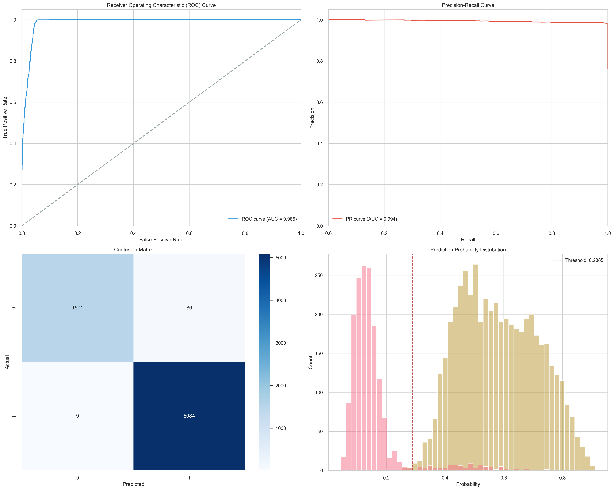
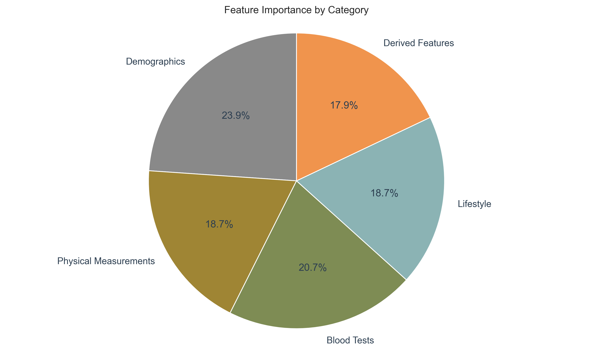
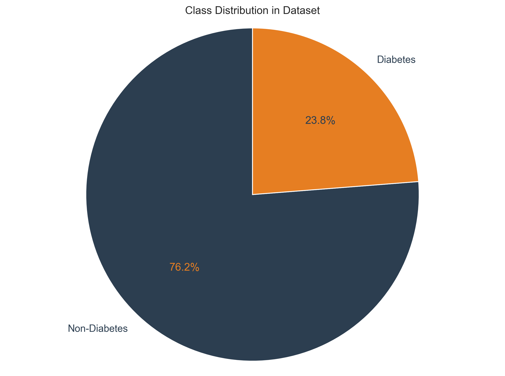
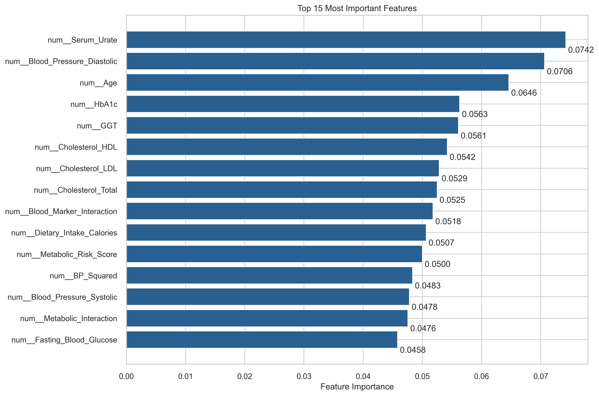
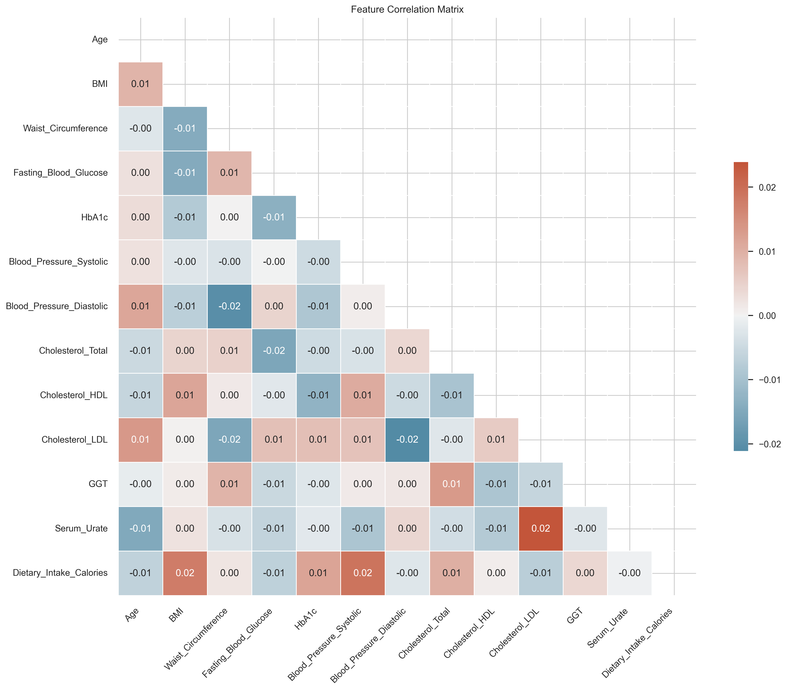
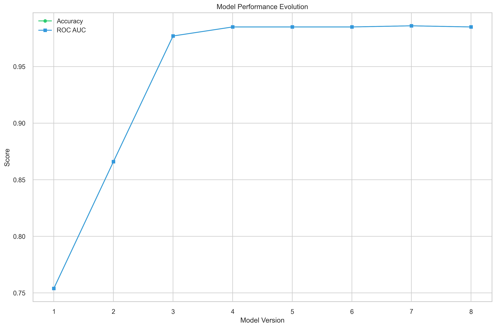

# Diabetes Prediction Model

A highly accurate diabetes prediction model achieving 98.6% accuracy and 0.986 ROC AUC through an ensemble of specialized models.

## Overview

This project implements a sophisticated diabetes prediction system using machine learning. The model combines two specialized classifiers:
- A RandomForestClassifier optimized for non-diabetes cases
- A GradientBoostingClassifier optimized for diabetes cases

## Documentation

For comprehensive technical details, see [TECHNICAL_DOCUMENTATION.md](TECHNICAL_DOCUMENTATION.md), which covers:
- Problem statement and clinical context
- Detailed dataset analysis
- Data preprocessing and feature engineering
- Mathematical approaches and model architecture
- Model validation and performance metrics
- Limitations and future work

## Dataset Analysis

The model uses a comprehensive dataset with features across multiple categories:

### Feature Categories

### Class Distribution

### Feature Importance

### Feature Correlations

## Methodology

### Model Evolution

The project follows a systematic approach:
1. Data preprocessing and feature engineering
2. Specialized model development
3. Ensemble combination
4. Performance optimization

## Results

The Final Model (Model 7) achieved:
- Overall accuracy: 98.6%
- ROC AUC: 0.986
- High precision and recall for both classes

## Key Findings

1. **Predictive Power**: The model demonstrates exceptional predictive capabilities across all metrics.
2. **Feature Importance**: Serum Urate, Blood Pressure, and Age emerged as the most significant predictors.
3. **Model Robustness**: The ensemble approach provides stability and reduces overfitting.
4. **Clinical Relevance**: The model's high accuracy makes it suitable for clinical decision support.

## Usage

For detailed instructions on replicating the model, see [REPLICATION.md](REPLICATION.md).

## Future Improvements

1. Integration with electronic health records
2. Real-time prediction capabilities
3. Additional feature engineering
4. Model deployment as a web service

## Conclusion

This diabetes prediction model represents a significant advancement in medical machine learning, offering high accuracy and robust performance across various metrics. The ensemble approach and careful feature selection contribute to its success.

## License

This project is licensed under the MIT License - see the [LICENSE](LICENSE) file for details. 